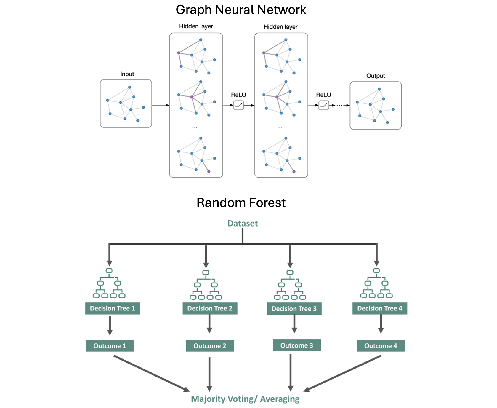
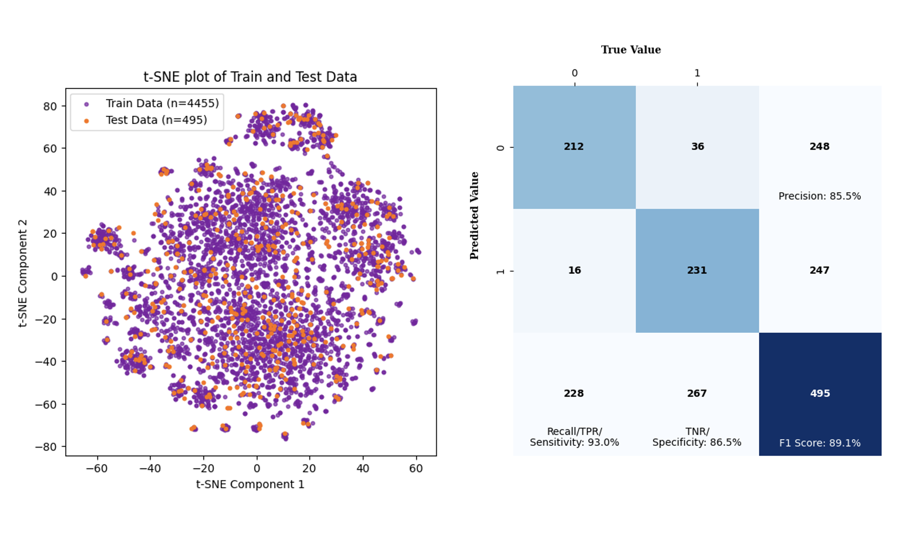
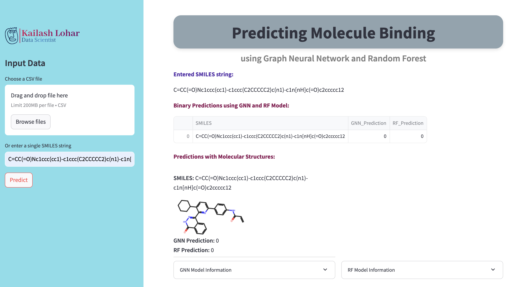

# Classification Models
This repository offers a complete solution for designing, training, and deploying Graph Neural Network (GNN) and Random Forest (RF) models. It includes Docker configurations, Jupyter notebooks, and a Streamlit app for easy model deployment. Users can upload data to the app, receive predictions from pre-trained models, and view visualizations of molecular structures and model performance. The project is organized for ease of use, from Docker setup to model deployment, providing a streamlined approach for implementing machine learning models.

## Project Structure

- `Makefile`: Scripts to build and manage Docker containers.
- `Readme.md`: Project documentation.
- `devops`: Directory containing Docker configurations and additional resources.
  - `docker-compose.yml`: Docker Compose configuration file.
  - `jupyterlab`: Contains Dockerfile and environment configuration for JupyterLab.
- `main`: The main directory contains Jupyter notebooks, machine learning models, and Streamlit applications.
  - `GNN`: Directory for Graph Neural Network (GNN) related models and notebooks.
    - `GNN_classifier.ipynb`: Jupyter notebook for training the GNN classifier.
    - `model_files`: Directory containing saved GNN models and related files.
  - `Random_Forest`: Directory for Random Forest related models and notebooks.
    - `RF_classifier.ipynb`: Jupyter notebook for training the Random Forest classifier.
    - `model_files`: Directory containing saved Random Forest models and related files.
  - `data`: Directory for storing datasets.
  - `logo.svg`: Project logo file.
  - `my_cm.py`: Custom confusion matrix plotting script.
  - `my_streamlit_app`: Directory for Streamlit application and associated files.
    - `main.py`: Main Streamlit application script.
    - `custom_styles.py`: Custom styles for the Streamlit app.
    - `logo.svg`: Logo used in the Streamlit app.
    - `models`: Directory for ML models used in the Streamlit app.
      - `GNN`: Directory for GNN-related files in the Streamlit app.
        - `gnn_predict.py`: Script for making predictions using the GNN model.
        - `model_files`: Directory containing the same saved GNN model files used in the app.
      - `Random_Forest`: Directory for Random Forest-related files in the Streamlit app.
        - `rf_predict.py`: Script for making predictions using the Random Forest model.
        - `model_files`: Directory containing the same saved Random Forest model files used in the app.
    - `utils.py`: Utility functions used in the Streamlit app.

## Docker Setup and Usage
Note: Make sure you have Docker installed on your system.
1.  Clone the repository to your local machine: `git clone git@github.com:KailashLohar/Classification_Models.git`

2.  Navigate to the project directory "**Classification_Models**" and run the following commands to build the Docker image :`make build-image`

3.  Start the container using command: `make start-container`

4.  Enter the Container using command: `make enter-container`

5.  Stop the Container using command: `make stop-container`

**Once you are inside Jupyterlab container, you can try out two different predictive models Graph Neural Network (GNN) and Random Forest (RF).**

## Steps followed in Graph Neural Network model:

1.  `Check system availability`: This step checks for GPU availability, sets the device accordingly (CUDA if available, otherwise CPU), and prints the remaining GPU and CPU availability percentages.
   
2.  `Load data`: loads a CSV file into a pandas DataFrame, displays the first few rows, and prints the shape of the DataFrame.
   
3.  `Remove salts and standardise SMILES`: This step processes the SMILES strings in a DataFrame by breaking bonds, neutralizing, and removing non-organic fragments and salts, then standardizes the remaining molecules and updates the DataFrame with the cleaned SMILES strings.

4.  `Balance dataset` Count the occurrences of each class in the Target column and then separates the majority class (label 0) and minority class (label 1) into two DataFrames. Down-samples the majority class to match the size of the minority class, combines the down-sampled majority class with the minority class, shuffles the combined DataFrame, and finally, rechecks the class distribution in the Target column.

5.  `Train test split`: The code splits the dataset into training and testing sets, with 10% of the data reserved for testing, ensuring that the class distribution in the Target column is preserved.

6.  `Visualise train test data`: The t-SNE algorithm is applied to the combined training and testing datasets for dimensionality reduction to two components. The results are visualized in a scatter plot, showing the distribution of train and test data, which is saved as an image.

7.  `Convert data into Graph format`: Defines a custom dataset class to handle molecular data by converting SMILES strings into graph representations, storing node features, edge indices, and target values.
   
8.  `Model architecture`: This step involves defining a molecular graph neural network model with multiple convolutional layers, batch normalization, dropout, and a linear output layer. The model architecture uses global pooling methods to combine node features before making predictions, suitable for graph-based tasks.
   
9.  `Model Training`: 
    - Cross-Validation and Training Setup: The code performs 5-fold cross-validation, splitting the dataset into training and validation sets for each fold. A new instance of the molecular graph neural network is initialized for each fold, with the model being trained using backpropagation.

    - Training Process: During each epoch, the model processes batches of graphs, computes predictions, and updates its weights by minimizing the loss function. The training loss is calculated for each batch, and after each epoch, the model is evaluated on the validation set to calculate the validation loss.

    - Early Stopping and Learning Rate Scheduling: The training loop includes early stopping, which halts training if the validation loss doesn't improve after a certain number of epochs. A learning rate scheduler adjusts the learning rate based on the validation loss to improve training efficiency.

    - Model Saving and Logging: After each fold, the model's state and loss metrics are saved to disk. The code provides updates on the training and validation losses, learning rate, and time taken for each fold, ensuring the training process is well-documented and monitored.

10.  `Training and Validation losses`: Generates subplots to visualize the training and validation losses across multiple folds, with each fold's losses displayed in separate graphs for comparison.

11.  `Make prediction on hold out sample`: The code loads pre-trained models from multiple folds and predicts the target values for each batch in the test set. It averages the predictions across models to provide a final prediction for each sample.

12.  `Model Evaluation`: Importing necessary modules and computes the confusion matrix using the true and predicted labels from the test results. Uses the PrettyConfusionMatrix function to visualize and save the confusion matrix as an image file.

## Steps followed in Random Forest model:

1.  `Check system availability`: This step checks for GPU availability, sets the device accordingly (CUDA if available, otherwise CPU), and prints the remaining GPU and CPU availability percentages.
   
2.  `Load data`: loads a CSV file into a pandas DataFrame, displays the first few rows, and prints the shape of the DataFrame.
   
3.  `Remove salts and standardise SMILES`: This step processes the SMILES strings in a DataFrame by breaking bonds, neutralizing, and removing non-organic fragments and salts, then standardizes the remaining molecules and updates the DataFrame with the cleaned SMILES strings.

4.  `Balance dataset` Count the occurrences of each class in the Target column and then separates the majority class (label 0) and minority class (label 1) into two DataFrames. Down-samples the majority class to match the size of the minority class, combines the down-sampled majority class with the minority class, shuffles the combined DataFrame, and finally, rechecks the class distribution in the Target column.

5.  `Train test split`: The code splits the dataset into training and testing sets, with 10% of the data reserved for testing, ensuring that the class distribution in the Target column is preserved.

6.  `Visualise train test data`: The t-SNE algorithm is applied to the combined training and testing datasets for dimensionality reduction to two components. Results are visualized in a scatter plot, showing the distribution of train and test data, which is saved as an image.

7.  `Get the descriptors`: 
    - Descriptor Calculation: The code calculates molecular descriptors for each molecule in the dataset using the RDKit library, and handles missing values during the descriptor calculation.
    - Normalization: It normalizes the calculated descriptors using Min-Max scaling and returns the normalized dataframe, which is then printed to show its shape.
   
8.  `Remove redundant and highly correlated columns`: 
    - This step removes redundant columns (those with a single unique value) and highly correlated columns (correlation above 0.6) from the dataset to prevent redundancy in the model training.
    - It then saves the list of remaining column names to a CSV file for later use in the model training process.
   
9.  `Model Training`: Initializes a RandomForestClassifier with specified hyperparameters and trains it on the training data (X_train and y_train). After training, the model is saved as a joblib file for future use.

10.  `Make prediction on hold out sample`: Load a pre-trained RandomForest model, normalizes the test data to match the training features, and generates predictions which are added to the test dataset for review.

11.  `Model Evaluation`: Importing necessary modules and computes the confusion matrix using the true and predicted labels from the test results. Uses the PrettyConfusionMatrix function to visualize and save the confusion matrix as an image file.

- - - - - - - - - - - - - - - - - - - - - - - - - - - - - - - - - - - - - - - - - - - - - - - - - - - - - - - - - - - - - - - - - - - - - 
- - - - - - - - - - - - - - - - - - - - - - - - - - - - - - - - - - - - - - - - - - - - - - - - - - - - - - - - - - - - - - - - - - - - - 
- - - - - - - - - - - - - - - - - - - - - - - - - - - - - - - - - - - - - - - - - - - - - - - - - - - - - - - - - - - - - - - - - - - - -

# Model Deployment
Model deployment using Docker and Streamlit involves creating a user-friendly web interface where users can input data (e.g., SMILES strings or CSV files) and receive predictions from pre-trained machine learning models. The provided code demonstrates how to build a Streamlit app that allows users to upload a CSV file or enter a SMILES string, which is then processed by both a Graph Neural Network (GNN) and a Random Forest (RF) model. The app displays predictions alongside molecular structures and provides insights into the model's performance, making the deployment accessible and interactive for users.

## Author

- Kailash Lohar  <kailashlohariitkgp@gmail.com>

## License

This project is licensed under the MIT License - see the LICENSE file for details.
